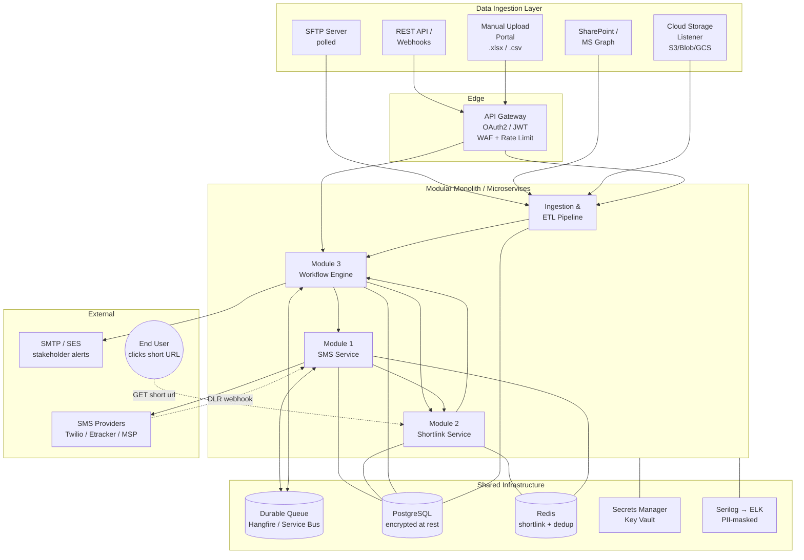
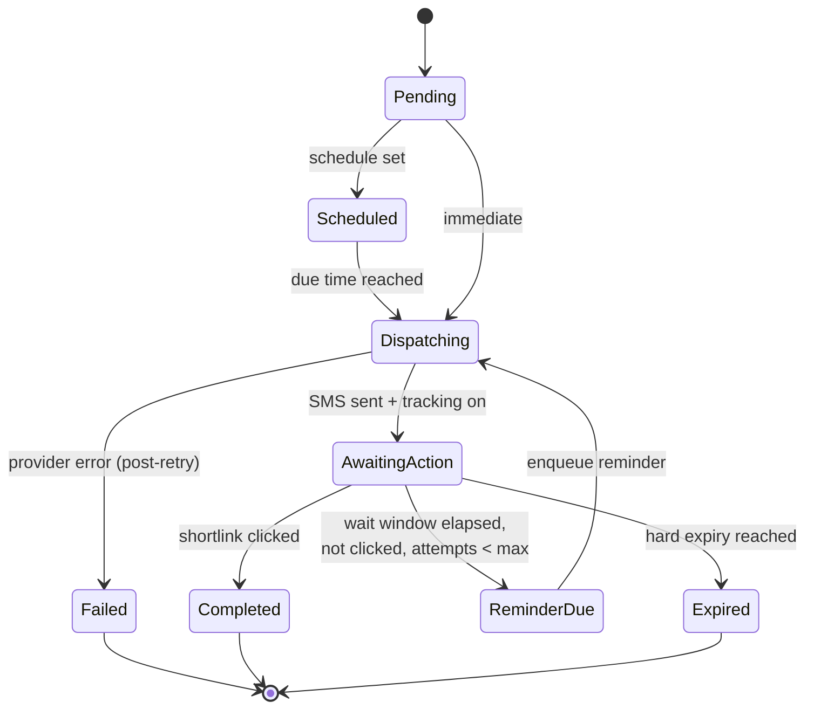
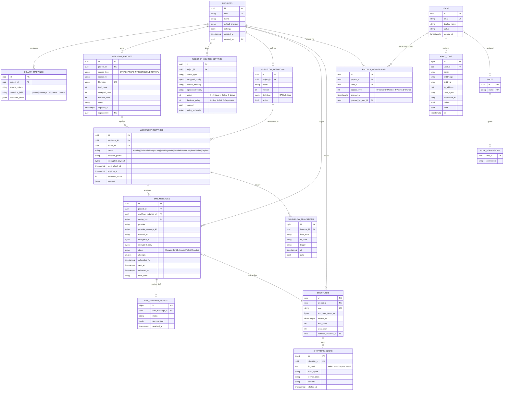
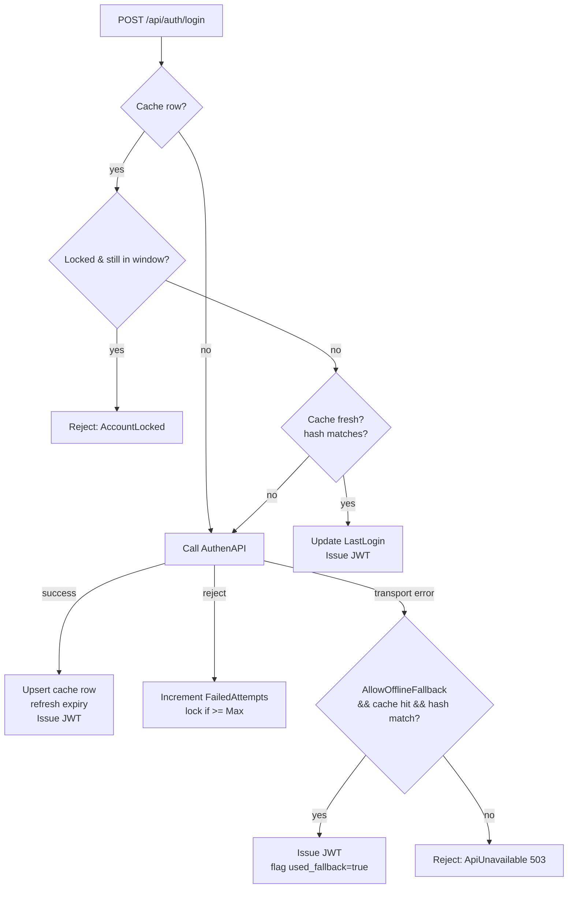

# Campaign & Notification Workflow Management System

**Version:** 1.0
**Audience:** Enterprise Architects, Backend Engineers, Security & Compliance Reviewers

---

## 1. Architecture & Refactoring Report

### 1.1 Legacy System Review (`Wachira-d/SendSMS`)

The legacy repository is a single-file .NET Framework 4.7.2 **console application** (`SendSMS/Program.cs`) that picks up CSV/XLSX files from a watched folder, mail-merges them into HTTP GET requests against an SMS gateway (`https://www.etracker.cc/bulksms/mesapi.aspx`), updates a SQL Server "vouchers" table, and writes a response CSV.

| # | Flaw / Bottleneck | Evidence in legacy code | Real-world impact |
|---|-------------------|--------------------------|-------------------|
| 1 | **Credentials in plaintext `App.config`** | `user`, `pass`, full DB connection string committed in XML | Repo leak = total compromise; no key rotation |
| 2 | **Secrets transmitted in query string** | `mesapi.aspx?user=…&pass=…&to=…&text=…` | Credentials and PII land in proxy/CDN/gateway access logs |
| 3 | **Synchronous, blocking HTTP** | `WebClient.DownloadString(...)` inside a loop | One slow recipient stalls the whole batch; no parallelism |
| 4 | **No retry / no circuit breaker** | Broad `try { } catch (Exception) { }` swallows failures | Transient 5xx errors result in silent message loss |
| 5 | **SQL injection** | Voucher lookups concatenated with row values | Any malicious data file owns the database |
| 6 | **No connection pooling discipline** | `SqlConnection` opened per row, no `using`/`await` | Pool exhaustion under load |
| 7 | **No idempotency / dedup** | Rerun of the same file re-sends every SMS | Duplicate messages billed and delivered |
| 8 | **No state machine** | Scheduling, reminders, expiration handled as ad-hoc conditional strings in config | Impossible to audit; no resumability after crash |
| 9 | **No structured logging** | `File.AppendAllText(log, …)` plaintext, includes PII | Cannot be ingested by SIEM; GDPR/PDPA breach |
| 10 | **Monolithic single binary** | One `Program.cs` does ingestion, transform, DB, HTTP, export | Cannot scale SMS independent of ingestion; no clear ownership |
| 11 | **Hex-encoding / URL substitution inline** | Buried in 1,000+ line `Main` | Untestable, regressions go undetected |
| 12 | **No tracking of delivery / click-through** | Fire-and-forget HTTP, no DLR ingestion | Cannot drive reminder workflows |

### 1.2 How the new design addresses each flaw

| Legacy flaw | New solution |
|-------------|--------------|
| 1, 2 | Secrets resolved at startup from **Azure Key Vault / AWS Secrets Manager / env vars** via `IConfiguration` providers; provider clients send credentials in headers, never the URL. |
| 3 | All I/O is `async/await`; SMS dispatch fans out through a **bounded `Channel<T>` worker pool** consuming a durable queue. |
| 4 | **Polly v8** resilience pipeline: timeout → retry with jitter → circuit breaker → fallback. Every provider call is wrapped. |
| 5 | **EF Core with parameterized queries** and a repository layer; raw SQL is forbidden by code-review rule. |
| 6 | `IHttpClientFactory` + `AddDbContextPool` give framework-managed pooling. |
| 7 | Every dispatched message has a `MessageId` (ULID) and a `DedupKey` (project + recipient + payload hash); the queue rejects re-enqueues within a TTL window. |
| 8 | **Workflow Engine** with explicit `WorkflowDefinition` (declarative JSON) and `WorkflowInstance` rows representing state — durable, auditable, resumable. |
| 9 | **Serilog** structured JSON sink, correlation IDs per request, a custom `PiiMaskingEnricher` rewrites phone numbers and message bodies before they hit any sink. |
| 10 | Three decoupled modules behind interfaces; modular monolith today, lift-and-shift to microservices tomorrow (each module already speaks via in-process MediatR contracts that map 1:1 to message-bus events). |
| 11 | Transformations are first-class `ITransformer` strategies registered in DI; each is unit-testable. |
| 12 | Providers return a `ProviderDispatchResult` with `ProviderMessageId`; a Delivery-Receipt (DLR) webhook updates `SmsMessage.Status`. Shortlink clicks are recorded in `ShortlinkClicks` and fed into the workflow engine. |

### 1.3 Non-functional targets

- **Throughput:** 500 SMS/sec sustained per dispatcher pod (bounded by provider).
- **Latency:** p95 enqueue→dispatch < 2s for `Immediate` priority.
- **Availability:** 99.9% (single-region active/passive; no single point of failure in ingest, queue, dispatcher).
- **Recovery:** RPO 5 min (DB PITR), RTO 30 min.
- **Compliance:** PII masked in all logs/metrics; encryption at rest (TDE) and in transit (TLS 1.2+).

---

## 2. Architecture Diagram (Mermaid)

### 2.1 High-level system view



### 2.2 Workflow state machine (per instance)



---

## 3. Database Schema (ERD)



### 3.1 Indexing & retention notes

- `SMS_MESSAGES (status, scheduled_for)` — dispatcher worker selects due rows.
- `WORKFLOW_INSTANCES (state, next_check_at)` — reminder scanner.
- `SHORTLINKS (slug)` — unique, covered.
- `AUDIT_LOGS` partitioned monthly; retention 7 years (regulatory).
- `SHORTLINK_CLICKS` partitioned monthly; PII fields (IP) stored only as **salted hash** + truncated geo.

---

## 4. Module Boundaries

| Module | Owns | Exposes (in-process / over-the-wire equivalent) |
|---|---|---|
| **Sms** | provider clients, queue, DLR webhook | `ISmsDispatcher.EnqueueAsync(SmsRequest)` ⇄ `sms.enqueue` topic |
| **Shortlink** | slug generation, redirect, click tracking | `IShortlinkService.CreateAsync` / `GET /s/{slug}` ⇄ `shortlink.click` event |
| **Workflow** | orchestration, state machine, reminders, expiry | `IWorkflowEngine.StartAsync(definition, context)` ⇄ `workflow.transition` event |

The three modules share **only** the `Core` library (security primitives, audit logger, masking, DTOs). They never reach into each other's tables.

---

## 5. Security Posture (summary)

- **AuthN:** OAuth 2.0 / OIDC (Azure AD or Auth0) — Bearer JWTs validated by the API gateway and each module.
- **AuthZ:** RBAC with permissions (`project.read`, `sms.dispatch`, `workflow.approve`, …) checked per-endpoint.
- **PII:** phone numbers and message bodies stored **encrypted (AES-GCM, key in KMS)**; `masked_to` (`+66****1234`) used for display and logs.
- **In transit:** TLS 1.2+, HSTS, mTLS between services.
- **At rest:** DB TDE; backups encrypted; secrets in Key Vault.
- **Logging:** Serilog JSON → ELK; `PiiMaskingEnricher` rewrites phone/email/message before serialization; correlation ID per request; **audit log table is append-only** (revoked `UPDATE`/`DELETE` for app role).
- **Webhook ingress:** HMAC-signed; replay-protected (nonce + timestamp window).
- **File upload:** virus scan (ClamAV), MIME sniff, size cap, server-side type whitelist.

---

## 6. Deliverable Map

| Deliverable | Where |
|---|---|
| Architecture & refactoring report | this file, §1 |
| Architecture diagram | this file, §2 |
| ERD | this file, §3 |
| Refactored SMS dispatch logic | `SMSManagement/Modules/Sms/**` |
| Workflow engine implementation | `SMSManagement/Modules/Workflow/**` |
| Shortlink service | `SMSManagement/Modules/Shortlink/**` |
| Ingestion + ETL | `SMSManagement/Modules/Ingestion/**` |
| Core security / logging primitives | `SMSManagement/Modules/Core/**` |
| EF Core schema (matches ERD) | `SMSManagement/Infrastructure/Persistence/AppDbContext.cs` |
| DI / startup wiring | `SMSManagement/Program.cs` |
| User & project-sharing module | `SMSManagement/Modules/Identity/**` |
| File-lifecycle ingestion pipeline | `SMSManagement/Modules/Ingestion/Services/IngestionPipeline.cs` |
| Reports + CSV export | `SMSManagement/Modules/Reporting/**` |
| Multi-provider router + Infobip impl | `SMSManagement/Modules/Sms/Providers/{ProviderRouter,InfobipSmsProvider}.cs` |

---

## 7. User & Project Sharing

### 7.1 Model

| Entity | Purpose |
|---|---|
| `User` | Local mirror of the IdP record (`ExternalSubject` = OIDC `sub`). Lets us FK from audit/membership rows. |
| `ProjectMembership` | Many-to-many between User ↔ Project with an explicit `AccessLevel` (`Viewer` < `Member` < `Admin` < `Owner`). |
| `Project.DefaultProvider` | Per-project provider override consumed by `ProviderRouter`. |

Every project has **exactly one Owner** (enforced by `TransferOwnershipAsync` running in a transaction). Sharing creates additional `Admin` / `Member` / `Viewer` rows.

### 7.2 Scoping — how a user only sees their projects

Two layers, deliberately redundant:

1. **EF Core global query filter** on `Project` (`AppDbContext.OnModelCreating`):
   ```csharp
   e.HasQueryFilter(p => _user.IsSystemAdmin
       || ProjectMemberships.Any(m => m.ProjectId == p.Id && m.UserId == _user.UserId));
   ```
   Any `_db.Projects.ToList()` is naturally restricted — a forgotten `WHERE` clause cannot leak data.
2. **Explicit `IProjectAccessService.EnsureAsync(projectId, level)`** at every write endpoint (`Share`, `Revoke`, `Upload`, `DispatchSms`, etc.) — fails fast with `UnauthorizedAccessException` when the caller lacks the required `AccessLevel`.

Background jobs (Hangfire) resolve a `SystemUserContext` (`IsSystemAdmin = true`) so the filter is bypassed for orchestration work that must touch every project.

### 7.3 API surface

```
GET    /api/projects                                   list visible projects (+ my level)
POST   /api/projects/{id}/members                      body: { userId, level }     (Admin+)
DELETE /api/projects/{id}/members/{userId}                                          (Admin+)
POST   /api/projects/{id}/transfer-ownership           body: newOwnerId            (Owner)
```

---

## 8. File Lifecycle & Idempotency

### 8.1 Where the guarantees live

| Guarantee | Mechanism |
|---|---|
| Same file content is **never processed twice by accident** | `IngestionBatches.FileHash` has a UNIQUE index, computed as SHA-256 of the file bytes. |
| Re-uploading is **safe to retry** when a network blip aborted the upload | `SmsMessages.DedupKey` (`SHA-256(projectId | recipient | bodyHash)`) UNIQUE — re-enqueue of the same logical message is a no-op. |
| Operators can **force a re-run** when needed (e.g. wrong template, wrong workflow active at first ingest) | `POST /api/projects/{id}/ingest?force=true` — the pipeline persists a new `IngestionBatch` with a suffixed hash (`{hash}#{ticks}`), and the row-level dedup key is unchanged, so already-sent recipients are still not re-sent unless their workflow definition has been rotated. |
| Original files are **traceable** | `IngestionSourceSettings.Action`: `Archive` (default), `Delete`, or `Leave` (read-only mount). On failure the file is always moved to `RejectedDirectory` with a timestamp suffix. |

### 8.2 Configurable per source

`IngestionSourceSettings` (one row per project × source binding):

| Field | Example | Meaning |
|---|---|---|
| `ArchiveDirectory` | `/data/honda/archive` | Successful files moved here. Filenames suffixed `…{yyyyMMddHHmmss}.csv`. |
| `RejectedDirectory` | `/data/honda/rejected` | Files that failed validation moved here with `.rejected` marker. |
| `Action` | `Archive` / `Delete` / `Leave` | Post-process strategy. `Leave` is for SharePoint / S3 read-only mounts; the unique `FileHash` index prevents re-pickup. |
| `DuplicatePolicy` | `Skip` (default) / `Fail` / `Reprocess` | What to do when the content hash matches a prior batch. |
| `PollingSchedule` | `*/5 * * * *` | Cron for polled sources (SFTP / SharePoint). |
| `Enabled` | `true` | Lets ops disable a binding without deleting it. |

### 8.3 Force-rerun procedure

```bash
# 1. From the portal: "Reprocess" button calls
POST /api/projects/{id}/ingest?force=true   (multipart: settingsId, file)

# 2. SMS dispatcher still sees the original DedupKey for each row and
#    refuses to re-send the same body to the same recipient.
#    To genuinely re-send the same template, bump the workflow definition
#    version — this changes the body template and therefore the DedupKey.
```

This split between **file-level** dedup (idempotent retries) and **row-level** dedup (anti-spam) is intentional — the most common operator mistake is double-uploading the same export, and we silently absorb that without re-billing thousands of SMS.

---

## 9. Reports

### 9.1 Catalogue (eight built-in reports)

| # | Report | Source tables | Primary metrics | Operational value |
|---|---|---|---|---|
| 1 | **SMS Campaign Summary** | `sms_messages` | per-day per-provider Queued / Sent / Delivered / Failed / Rejected, **delivery rate**, **failure rate** | Marketing/CRM team sees daily campaign health at a glance; flags days where provider quality dropped. |
| 2 | **Provider Performance** *(global, admin-only)* | `sms_messages` | volume, delivery rate, avg attempts, avg dispatch latency, circuit-breaker trips | Drives provider contract negotiation and the Etracker→Infobip migration decision. |
| 3 | **Delivery Funnel** | `workflow_instances`, `sms_messages`, `shortlink_clicks` | Targeted → Sent → Delivered → Clicked → Converted, with rate at each stage | Identifies *where* drop-off occurs (dispatch? carrier? message itself? landing page?). |
| 4 | **Shortlink Performance** | `shortlinks`, `shortlink_clicks` | clicks, unique IP-hash count, first/last click, top device, top country | Content/UX team optimises CTAs; flags fraudulent click patterns (single IP). |
| 5 | **Reminder Effectiveness** | `workflow_instances` | conversions split by reminder number (0/1/2/3+), expiration count | Answers "is the 3rd reminder worth the cost?" — directly cuts SMS spend. |
| 6 | **Ingestion Quality** | `ingestion_batches` | per-batch total/accepted/rejected rows, acceptance rate, status | Data team sees which sources produce dirty data; catches mapping regressions early. |
| 7 | **Audit Trail** | `audit_logs` | every Action × Entity × User × IP × Correlation ID | Compliance + incident response (who shared which project to whom, when). |
| 8 | **User Activity** *(derived from audit_logs)* | `audit_logs` | logins, dispatches initiated, exports downloaded | Detects compromised accounts via anomaly (e.g. weekend bulk export). |

### 9.2 Common rules

- **All project-scoped reports** go through `IReportingService.EnsureProjectVisibleAsync` → reuses the same `IUserContext` as the EF query filter.
- **No raw PII columns** are projected — only counts, rates, and masked identifiers (`MaskedTo`, `IpHash`).
- **CSV export** streams via `CsvHelper` (no in-memory buffering of full result).
- **Cross-project endpoints** (e.g. Provider Performance) require the `audit.read` permission and are surfaced under `/api/reports/*`.

### 9.3 API surface

```
GET /api/projects/{id}/reports/sms-campaign?from&to
GET /api/projects/{id}/reports/delivery-funnel?from&to
GET /api/projects/{id}/reports/shortlinks?from&to&top=50
GET /api/projects/{id}/reports/reminder-effectiveness
GET /api/projects/{id}/reports/ingestion-quality?from&to
GET /api/projects/{id}/reports/sms-campaign/export.csv?from&to
GET /api/reports/provider-performance?from&to                    # admin only
```

---

## 10. Multi-provider SMS abstraction (Etracker → Infobip)

### 10.1 The contract

Every provider implements:

```csharp
public interface ISmsProvider {
    string Name { get; }
    Task<ProviderDispatchResult> DispatchAsync(SmsRequest request, CancellationToken ct);
}
```

Callers (`SmsDispatcher`, `WorkflowEngine`) never see a concrete provider — they go through `IProviderRouter`:

```csharp
public interface IProviderRouter {
    ISmsProvider Resolve(SmsRequest request);
    ISmsProvider? Fallback(SmsRequest request, string failedProviderName);
}
```

### 10.2 Resolution order

1. **`Projects.DefaultProvider`** — Admin sets this in the UI; takes precedence over everything else.
2. **Canary split** — `Sms:Routing:CandidateProvider` + `CandidateTrafficPercent` route a deterministic % of traffic (hashed on recipient so the same user always lands on the same provider) to the candidate.
3. **Global default** — `Sms:Routing:DefaultProvider`.

Failover (`IProviderRouter.Fallback`) walks `FailoverChain`, skipping the failed provider. `SmsDispatcher` calls it automatically when the primary throws after Polly's retry budget is exhausted.

### 10.3 Migration playbook — Etracker → Infobip

1. **Add Infobip credentials** to Key Vault (`Sms:Providers:Infobip:ApiKey`, `BaseUrl`, `DefaultSenderId`). No code change required — `InfobipSmsProvider` is already registered.
2. **Smoke test**: temporarily set one pilot project's `DefaultProvider = "infobip"` via the Projects admin endpoint. Validate delivery + DLR webhook end-to-end. Roll back instantly by clearing the override.
3. **Canary**: set `Sms:Routing:CandidateProvider = "infobip"`, `CandidateTrafficPercent = 5`. Watch the **Provider Performance report** for 24–48 h. Ramp 5 → 25 → 50 → 100.
4. **Cutover**: flip `Sms:Routing:DefaultProvider` to `"infobip"`. Keep `FailoverChain = ["infobip","etracker"]` so a sudden Infobip outage falls back to Etracker until the contract ends.
5. **Decommission**: once Etracker contract ends, drop `EtrackerSmsProvider` from DI registration. No other code changes needed.

The router pattern means **switching providers is a config-only operation** — no caller of `ISmsDispatcher` is aware of the change.

---

## 11. Cache-First Login (AuthenAPI + UserCache)

### 11.1 Why cache

Going to the upstream AuthenAPI on every request would couple every login to its uptime and double our latency budget. The `UserCache` table lets us:

- **Skip the API** when the user's password hasn't rotated and the cache is fresh (~zero-latency login).
- **Stay up during IdP outages** — fall back to the cached hash for users who have logged in before.
- **Enforce app-side lockout** independent of (and stricter than) the upstream policy.
- **Mirror AD attributes** (display name, email, department, groups) for UI rendering without an extra LDAP hop.

### 11.2 Decision matrix (implemented in `UserCacheAuthenticator`)

| Cache state | Hash match | Action |
|---|---|---|
| none | — | call AuthenAPI; on success insert cache row |
| present, expired | — | call AuthenAPI; on success refresh cache |
| present, fresh | match | **accept from cache** (no API call) |
| present, fresh | mismatch | call AuthenAPI (the user may have rotated their password) |
| API unavailable | cache hit & hash match | **accept from cache** (offline fallback) |
| API unavailable | no usable cache | reject with 503 |

Per-account lockout is checked **before** anything else: `FailedAttempts >= MaxFailedAttempts` flips `IsLocked = true` for `LockoutDurationMinutes`; after the window elapses the row auto-resets on the next attempt.

### 11.3 Flow



### 11.4 Configuration (all knobs in `appsettings.json` / Key Vault)

```json
"UserCacheAuth": {
  "CacheDurationDays":     90,
  "PasswordSalt":          "<from KeyVault>",   // app-wide pepper
  "MaxFailedAttempts":     5,
  "LockoutDurationMinutes": 15,
  "AllowOfflineFallback":  true
},
"AuthenApi": {
  "BaseUrl":        "https://idp.internal/",    // upstream service
  "ApiKey":         "<from KeyVault>",
  "TimeoutSeconds": 5
},
"Auth": {
  "LocalJwt": {
    "Issuer":               "campaign-api",
    "Audience":             "campaign-api",
    "SigningKeyBase64":     "<from KeyVault, >= 32 bytes>",
    "TokenLifetimeMinutes": 60
  }
}
```

The salt/pepper, AuthenAPI key, and JWT signing key MUST be injected from Key Vault at startup — the `appsettings.json` ships with empty strings, and the relevant services throw on construction if a value is missing.

### 11.5 Storage

`UserCache` row mirrors the spec's `dbo.User_Cache` table 1:1 (modelled in EF Core for Postgres):

| Column | Notes |
|---|---|
| `Username` | unique, lowercased on insert |
| `PasswordHash` | SHA-256(password + `Salt` + app pepper), 64 hex chars |
| `Salt` | per-user random, generated by `IPasswordHasher.NewSalt()` |
| `GroupsJson` | JSON array of AD groups → mapped to `perm` claims by `JwtTokenIssuer` |
| `IsLocked`, `FailedAttempts`, `LastFailedLogin` | app-side lockout state |
| `LastAdSync`, `CacheExpires` | refresh + hard-expiry timestamps |

The stored procedures in the spec (`sp_UpsertUserCache`, `sp_UpdateLastLogin`, `sp_RecordFailedLogin`, `sp_ResetFailedAttempts`) are implemented as private methods on `UserCacheAuthenticator` and run inside the same DbContext as the surrounding business logic — no procedural SQL, no string concatenation, parameterised by EF Core.

### 11.6 Token issuance

On success `JwtTokenIssuer.IssueForCachedUserAsync` produces a JWT signed with `Auth:LocalJwt:SigningKeyBase64` (HMAC-SHA-256). Claims:

| Claim | Value |
|---|---|
| `sub` | username |
| `app_user_id` | `Users.Id` (the local Guid the rest of the app uses) |
| `email`, `name` | display values |
| `group` (multi) | every AD group from `UserCache.GroupsJson` |
| `perm` (multi) | derived from groups via the mapping table in `JwtTokenIssuer.MapGroupsToPermissions` |

The same `AddJwtBearer` middleware that validates external OIDC tokens validates these (configured to accept either `Authority` or the local `IssuerSigningKey`), so every downstream endpoint works unchanged.

### 11.7 Defence in depth

- **Per-account lockout** (`UserCacheAuthOptions.MaxFailedAttempts`) — recorded in `UserCache`.
- **Per-IP rate limit** on `/api/auth/login` — fixed window (10 req/min/IP) configured in `Program.cs`, defeats credential stuffing from a single source even before the per-account counter triggers.
- **Constant-time hash compare** — `CryptographicOperations.FixedTimeEquals` defeats timing attacks.
- **No password in logs** — `PiiMaskingEnricher` and explicit avoidance of `password` in any log statement.
- **Algorithm pluggability** — `IPasswordHasher` lets us swap SHA-256 for Argon2id without touching the authenticator. (Recommended for any new deployment; the spec calls for SHA-256 for compatibility.)
- **Append-only audit log** for every auth event (`auth.cache_hit`, `auth.api_success`, `auth.rejected`, `auth.locked`, `auth.offline_fallback`, …) — feeds the Audit Trail report (§9.1 #7).

### 11.8 Login audit table

In addition to the structured-log audit, every authentication attempt is persisted to a dedicated **`LoginAudits`** table so SecOps can query it directly:

| Column | Why it matters |
|---|---|
| `Username` | indexed with `CreatedAt` → "show me everything for user X in the last hour" |
| `Success` | `(Success, CreatedAt)` index for spike detection |
| `AuthSource` | `Cache` / `AuthenApi` / `CacheFallback` / `RefreshToken` — distinguishes routine cache hits from fallback (interesting) and from cookie refresh (sus if too frequent) |
| `FailureReason` | the exact rejection reason (`invalid credentials`, `account locked`, `HTTP_503`, …) |
| `IpAddress`, `UserAgent` | every login attempt is geo/device-attributable |
| `CorrelationId` | join key to the full Serilog request log |

Writes happen on a **fresh DbContext scope** so an audit-write failure can never poison the auth response.

### 11.9 Remember-Me (refresh tokens)

`RememberMe: true` on `/api/auth/login` issues a 32-byte URL-safe random token, stored only as **SHA-256 hash** in `RefreshTokens`. The raw value lives in a cookie:

```
Set-Cookie: rt=<token>; HttpOnly; Secure; SameSite=Lax; Path=/api/auth; Expires=<+RememberMeDurationDays>
```

| Concern | Mitigation |
|---|---|
| Cookie theft | Cookie is `HttpOnly` (no JS access), `Secure` (TLS only), `Path=/api/auth` (never sent on business APIs that don't need it). |
| Replay | Every `/api/auth/refresh` **rotates** the token — the old hash is marked `RevokedAt='rotated'`, a new one is issued. |
| Reuse of a revoked token | Treated as evidence of theft: the entire token family for that user is revoked (`reuse_detected`), forcing legitimate cookie holders to re-login. |
| DB leak | Only SHA-256 of the token is stored; an attacker with DB read access still cannot mint cookies. |
| Account state | Refresh re-checks `UserCache.IsEnabled` and `IsLocked` — disabling a user in AD takes effect on the next refresh without waiting for the JWT to expire. |

Endpoints:

```
POST /api/auth/login          username/password (+ optional RememberMe, ReturnUrl) → JWT (+ cookie)
POST /api/auth/refresh        cookie only                                          → new JWT (+ rotated cookie)
POST /api/auth/logout         authenticated; revokes cookie's refresh token
GET  /api/auth/me             authenticated; returns claims for the SPA
```

### 11.10 Open-redirect protection

`/api/auth/login` accepts `ReturnUrl`. The response field `return_url` is sanitised by `SafeRedirect.Resolve` — any value that

- starts with `//` or `\\` (protocol-relative)
- parses as an absolute URI (`http://evil.com/...`)
- does not begin with a single `/`

is replaced by `"/"`. The SPA echoes back exactly what the server returned, never the raw query parameter.

### 11.11 AuthenAPI wire format

Per spec — `AuthenApiClient` implements this exactly:

```http
POST {BaseUrl}/api/ldap/authenticate
Content-Type: application/json
X-API-Key: {ApiKey}

{ "username": "john.doe", "password": "..." }
```

Success response (envelope shape):
```json
{
  "success": true, "message": "Authentication successful",
  "data": {
    "samAccountName": "john.doe", "displayName": "John Doe",
    "email": "john.doe@company.com", "department": "IT",
    "title": "Developer", "employeeId": "EMP001",
    "groups": ["Domain Users","IT Team"], "isEnabled": true
  }
}
```

Failure response → translated to a non-success `AuthenApiResult`:
```json
{ "success": false, "message": "Invalid username or password" }
```

Both the path and the API-key header name are config-driven (`AuthenApi:AuthenticatePath`) so a future IdP migration is a settings change.

### 11.12 Sessions in a JWT world

The spec lists ASP.NET WebForms `Session["…"]` storage. In this stateless JWT API, the equivalents are:

| WebForms concept | JWT API equivalent |
|---|---|
| `Session["Username"]`, `Session["DisplayName"]`, … | Claims (`sub`, `name`, `email`, `group`, `perm`) in the bearer token; SPA reads via `GET /api/auth/me`. |
| `Session.Timeout = 8h` | `UserCacheAuth:SessionTimeoutHours = 8` → drives the JWT `exp` claim. |
| `Session.Abandon()` on logout | `POST /api/auth/logout` revokes the refresh-token cookie; the SPA drops the bearer; the JWT itself expires naturally (or is blocklisted in a future iteration if early revocation is required). |
| Per-page `ValidateSession()` | `[Authorize]` attribute + the standard `AddJwtBearer` middleware on every controller. |

