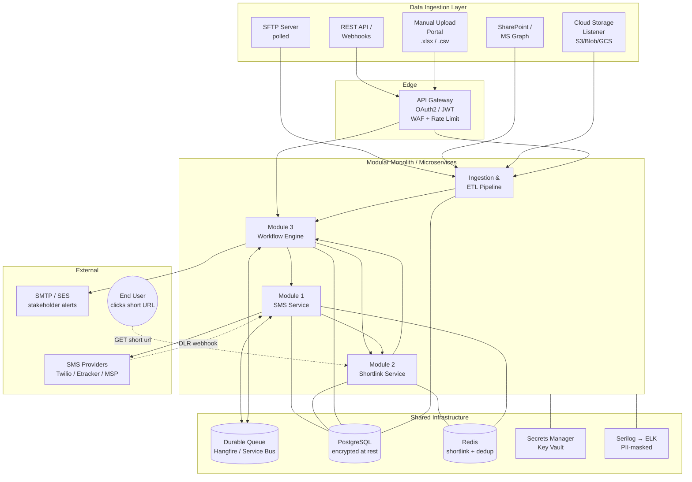
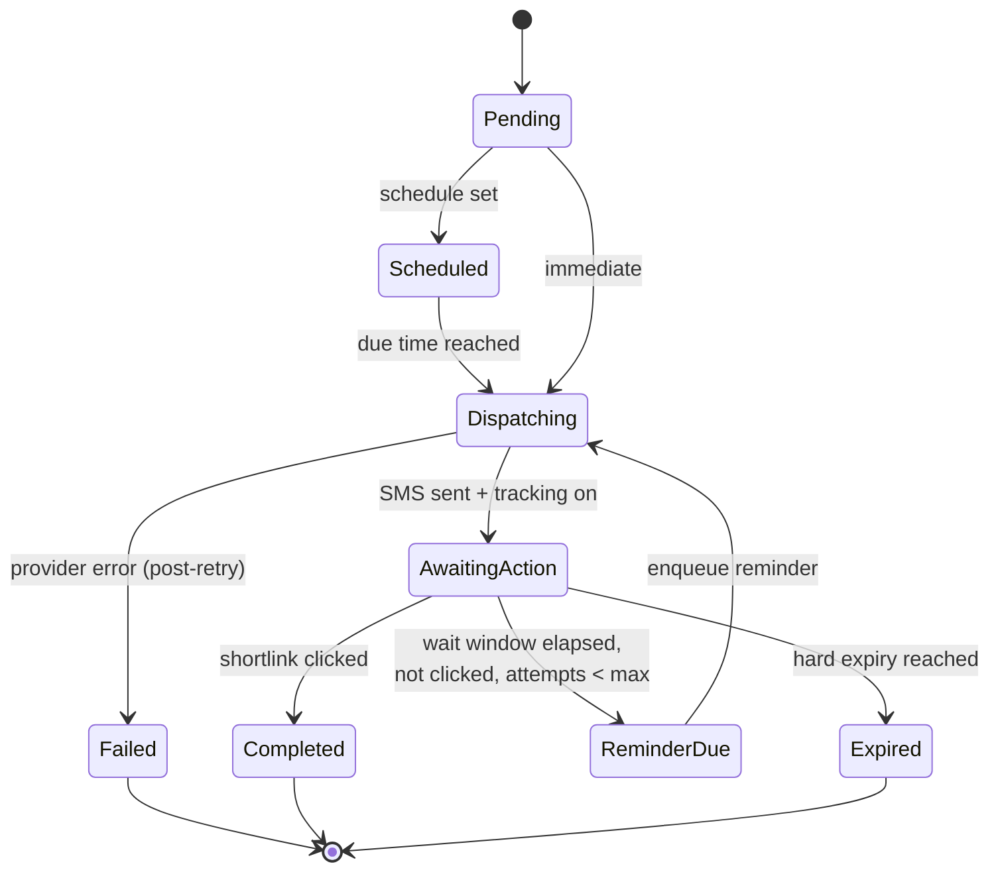
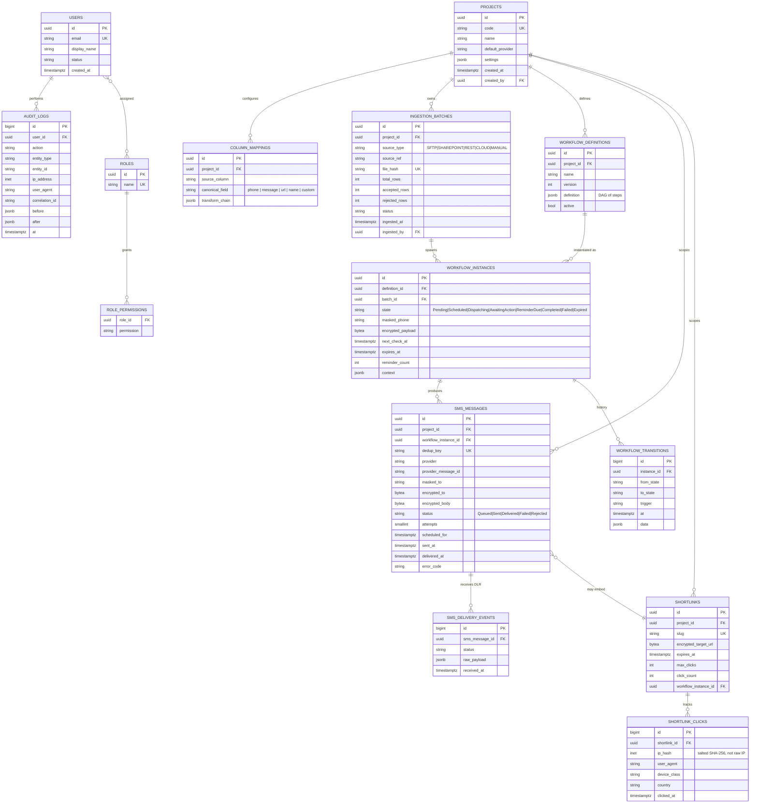

# Campaign & Notification Workflow Management System

**Version:** 1.0
**Audience:** Enterprise Architects, Backend Engineers, Security & Compliance Reviewers

---

## 1. Architecture & Refactoring Report

### 1.1 Legacy System Review (`Wachira-d/SendSMS`)

The legacy repository is a single-file .NET Framework 4.7.2 **console application** (`SendSMS/Program.cs`) that picks up CSV/XLSX files from a watched folder, mail-merges them into HTTP GET requests against an SMS gateway (`https://www.etracker.cc/bulksms/mesapi.aspx`), updates a SQL Server "vouchers" table, and writes a response CSV.

| # | Flaw / Bottleneck | Evidence in legacy code | Real-world impact |
|---|-------------------|--------------------------|-------------------|
| 1 | **Credentials in plaintext `App.config`** | `user`, `pass`, full DB connection string committed in XML | Repo leak = total compromise; no key rotation |
| 2 | **Secrets transmitted in query string** | `mesapi.aspx?user=…&pass=…&to=…&text=…` | Credentials and PII land in proxy/CDN/gateway access logs |
| 3 | **Synchronous, blocking HTTP** | `WebClient.DownloadString(...)` inside a loop | One slow recipient stalls the whole batch; no parallelism |
| 4 | **No retry / no circuit breaker** | Broad `try { } catch (Exception) { }` swallows failures | Transient 5xx errors result in silent message loss |
| 5 | **SQL injection** | Voucher lookups concatenated with row values | Any malicious data file owns the database |
| 6 | **No connection pooling discipline** | `SqlConnection` opened per row, no `using`/`await` | Pool exhaustion under load |
| 7 | **No idempotency / dedup** | Rerun of the same file re-sends every SMS | Duplicate messages billed and delivered |
| 8 | **No state machine** | Scheduling, reminders, expiration handled as ad-hoc conditional strings in config | Impossible to audit; no resumability after crash |
| 9 | **No structured logging** | `File.AppendAllText(log, …)` plaintext, includes PII | Cannot be ingested by SIEM; GDPR/PDPA breach |
| 10 | **Monolithic single binary** | One `Program.cs` does ingestion, transform, DB, HTTP, export | Cannot scale SMS independent of ingestion; no clear ownership |
| 11 | **Hex-encoding / URL substitution inline** | Buried in 1,000+ line `Main` | Untestable, regressions go undetected |
| 12 | **No tracking of delivery / click-through** | Fire-and-forget HTTP, no DLR ingestion | Cannot drive reminder workflows |

### 1.2 How the new design addresses each flaw

| Legacy flaw | New solution |
|-------------|--------------|
| 1, 2 | Secrets resolved at startup from **Azure Key Vault / AWS Secrets Manager / env vars** via `IConfiguration` providers; provider clients send credentials in headers, never the URL. |
| 3 | All I/O is `async/await`; SMS dispatch fans out through a **bounded `Channel<T>` worker pool** consuming a durable queue. |
| 4 | **Polly v8** resilience pipeline: timeout → retry with jitter → circuit breaker → fallback. Every provider call is wrapped. |
| 5 | **EF Core with parameterized queries** and a repository layer; raw SQL is forbidden by code-review rule. |
| 6 | `IHttpClientFactory` + `AddDbContextPool` give framework-managed pooling. |
| 7 | Every dispatched message has a `MessageId` (ULID) and a `DedupKey` (project + recipient + payload hash); the queue rejects re-enqueues within a TTL window. |
| 8 | **Workflow Engine** with explicit `WorkflowDefinition` (declarative JSON) and `WorkflowInstance` rows representing state — durable, auditable, resumable. |
| 9 | **Serilog** structured JSON sink, correlation IDs per request, a custom `PiiMaskingEnricher` rewrites phone numbers and message bodies before they hit any sink. |
| 10 | Three decoupled modules behind interfaces; modular monolith today, lift-and-shift to microservices tomorrow (each module already speaks via in-process MediatR contracts that map 1:1 to message-bus events). |
| 11 | Transformations are first-class `ITransformer` strategies registered in DI; each is unit-testable. |
| 12 | Providers return a `ProviderDispatchResult` with `ProviderMessageId`; a Delivery-Receipt (DLR) webhook updates `SmsMessage.Status`. Shortlink clicks are recorded in `ShortlinkClicks` and fed into the workflow engine. |

### 1.3 Non-functional targets

- **Throughput:** 500 SMS/sec sustained per dispatcher pod (bounded by provider).
- **Latency:** p95 enqueue→dispatch < 2s for `Immediate` priority.
- **Availability:** 99.9% (single-region active/passive; no single point of failure in ingest, queue, dispatcher).
- **Recovery:** RPO 5 min (DB PITR), RTO 30 min.
- **Compliance:** PII masked in all logs/metrics; encryption at rest (TDE) and in transit (TLS 1.2+).

---

## 2. Architecture Diagram (Mermaid)

### 2.1 High-level system view

### 2.2 Workflow state machine (per instance)

---

## 3. Database Schema (ERD)

### 3.1 Indexing & retention notes

- `SMS_MESSAGES (status, scheduled_for)` — dispatcher worker selects due rows.
- `WORKFLOW_INSTANCES (state, next_check_at)` — reminder scanner.
- `SHORTLINKS (slug)` — unique, covered.
- `AUDIT_LOGS` partitioned monthly; retention 7 years (regulatory).
- `SHORTLINK_CLICKS` partitioned monthly; PII fields (IP) stored only as **salted hash** + truncated geo.

---

## 4. Module Boundaries

| Module | Owns | Exposes (in-process / over-the-wire equivalent) |
|---|---|---|
| **Sms** | provider clients, queue, DLR webhook | `ISmsDispatcher.EnqueueAsync(SmsRequest)` ⇄ `sms.enqueue` topic |
| **Shortlink** | slug generation, redirect, click tracking | `IShortlinkService.CreateAsync` / `GET /s/{slug}` ⇄ `shortlink.click` event |
| **Workflow** | orchestration, state machine, reminders, expiry | `IWorkflowEngine.StartAsync(definition, context)` ⇄ `workflow.transition` event |

The three modules share **only** the `Core` library (security primitives, audit logger, masking, DTOs). They never reach into each other's tables.

---

## 5. Security Posture (summary)

- **AuthN:** OAuth 2.0 / OIDC (Azure AD or Auth0) — Bearer JWTs validated by the API gateway and each module.
- **AuthZ:** RBAC with permissions (`project.read`, `sms.dispatch`, `workflow.approve`, …) checked per-endpoint.
- **PII:** phone numbers and message bodies stored **encrypted (AES-GCM, key in KMS)**; `masked_to` (`+66****1234`) used for display and logs.
- **In transit:** TLS 1.2+, HSTS, mTLS between services.
- **At rest:** DB TDE; backups encrypted; secrets in Key Vault.
- **Logging:** Serilog JSON → ELK; `PiiMaskingEnricher` rewrites phone/email/message before serialization; correlation ID per request; **audit log table is append-only** (revoked `UPDATE`/`DELETE` for app role).
- **Webhook ingress:** HMAC-signed; replay-protected (nonce + timestamp window).
- **File upload:** virus scan (ClamAV), MIME sniff, size cap, server-side type whitelist.

---

## 6. Deliverable Map

| Deliverable | Where |
|---|---|
| Architecture & refactoring report | this file, §1 |
| Architecture diagram | this file, §2 |
| ERD | this file, §3 |
| Refactored SMS dispatch logic | `SMSManagement/Modules/Sms/**` |
| Workflow engine implementation | `SMSManagement/Modules/Workflow/**` |
| Shortlink service | `SMSManagement/Modules/Shortlink/**` |
| Ingestion + ETL | `SMSManagement/Modules/Ingestion/**` |
| Core security / logging primitives | `SMSManagement/Modules/Core/**` |
| EF Core schema (matches ERD) | `SMSManagement/Infrastructure/Persistence/AppDbContext.cs` |
| DI / startup wiring | `SMSManagement/Program.cs` |
